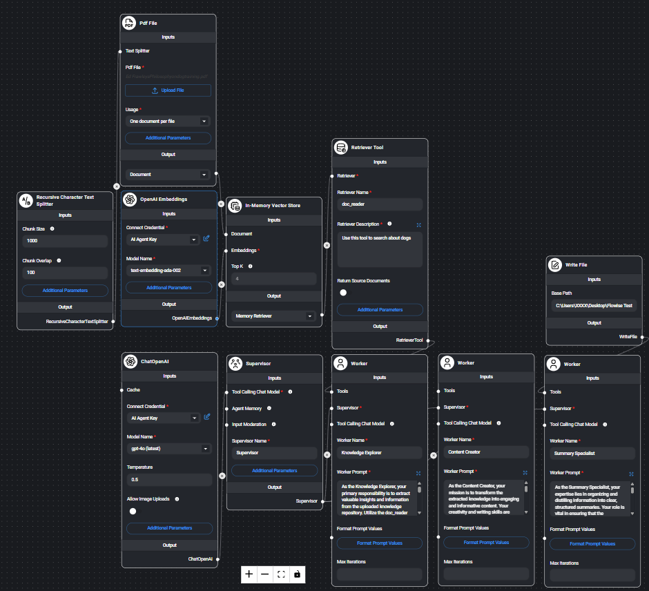

# Flowise-RagAgentLab 🤖

RAG Agent Lab es una aplicación basada en agentes colaborativos de inteligencia artificial, diseñada para transformar documentos PDF en conocimiento estructurado, contenido creativo y resúmenes inteligentes. 

Construido con [FlowiseAI](https://flowiseai.com/), este proyecto integra capacidades de **Retrieval-Augmented Generation (RAG)**, dividiendo, embebiendo y recuperando texto de forma inteligente con herramientas modernas como `RecursiveCharacterTextSplitter`, `In-Memory Vector Store` y `Retriever Tool`, además de usar `OpenAI GPT-4o` como modelo base.

---

## 📦 Estructura del proyecto

```
rag-agent-knowledge-pipeline/
├── .gitignore
├── LICENSE
├── README.md
│
├── flowise/
│   └── agent/
│       └── rag_pipeline_agent.json
│
├── app/
│   ├── main.py
│   ├── main.ks
│   ├── curl.txt
│   ├── Embed/
│       ├── Fullpage-Html.html
│       ├── Fullpage-React.jsx
│       ├── PopUp-Html.js
│       └── PopUp-React.jsx
│
└── docs/
│   └── screenshots/
│       └── flow-diagram.png

```

---

## 🧠 Arquitectura y componentes

### 🪓 Text Splitting

- **`RecursiveCharacterTextSplitter`**: Fragmenta el contenido de los PDFs en bloques optimizados para embeddings, respetando estructura y contexto.

### 📦 Vector Store

- **`In-Memory Vector Store`**: Almacena vectores en memoria con acceso ultra rápido.
- **`OpenAIEmbeddings`**: Usa el modelo `text-embedding-ada-002` para convertir texto en vectores semánticos.

### 🔍 Recuperación

- **`Retriever Tool`**: Permite que los agentes recuperen información contextual desde los vectores embebidos.

### 💬 Conexión con modelo de lenguaje

- **`ChatOpenAI` (GPT-4o)**: Todos los agentes se comunican con GPT-4o para procesar, crear y resumir el conocimiento.

### 🧩 Agentes IA

- **Supervisor**: Orquesta el flujo lógico del sistema.
- **Knowledge Explorer**: Extrae datos clave desde los PDFs.
- **Content Creator**: Redacta un blog post y 5 tweets.
- **Summary Specialist**: Resume toda la conversación y guarda el resultado.

---

## 🛠️ Tecnologías

| Componente       | Herramienta                         |
|------------------|--------------------------------------|
| Framework visual | FlowiseAI                           |
| LLM              | OpenAI GPT-4o                        |
| Splitting        | RecursiveCharacterTextSplitter       |
| Embeddings       | text-embedding-ada-002               |
| Vector DB        | In-Memory Vector Store               |
| Recuperación     | LangChain Retriever Tool             |
| Pipeline         | Supervisor + Agentes especializados  |
| Backend opcional | Python + FastAPI                     |

---

## ⚙️ ¿Cómo usar?

### 1. Instala Flowise

Puedes instalar Flowise de forma local con `npm` o `yarn`. Asegúrate de tener Node.js 18+ y npm instalado:

```bash
# Opción 1: con npm
npm install -g flowise

# Opción 2: con yarn
yarn global add flowise
```

> 📌 Si prefieres usar Docker, visita: [https://docs.flowiseai.com/getting-started/docker](https://docs.flowiseai.com/getting-started/docker)

---

### 2. Ejecuta Flowise

Inicia Flowise localmente con:

```bash
flowise start
```

Esto levantará la interfaz en:  
👉 `http://localhost:3000`

---

### 3. Importa el agente

Desde la interfaz de Flowise:

1. Navega a `http://localhost:3000`
2. En el panel lateral, haz clic en **"Agents"**
3. Usa la opción **"Import JSON"** y selecciona el archivo:

```
flowise/agent/rag_pipeline_agent.json
```

---

### 4. Prepara tus documentos PDF

Coloca tus archivos PDF en la siguiente carpeta:

```
data/sample_docs/
```

---

### 5. Ejecuta el pipeline

Flowise se encargará automáticamente de:

- Dividir el texto con `RecursiveCharacterTextSplitter`
- Embebe con `OpenAIEmbeddings`
- Guardar vectores en `In-Memory Vector Store`
- Recuperar con `Retriever Tool`
- Procesar con agentes especializados (`ChatOpenAI`)
- Generar contenido y resumen en: `output/summaries/`

---

## 📸 Diagrama del flujo



---

## 💡 Nota

Este repositorio demuestra cómo los agentes pueden colaborar para procesar y generar contenido a partir de documentos usando técnicas modernas de IA generativa y recuperación semántica.
